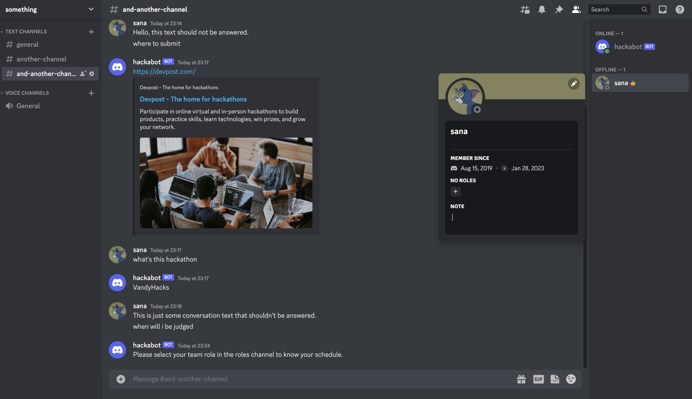
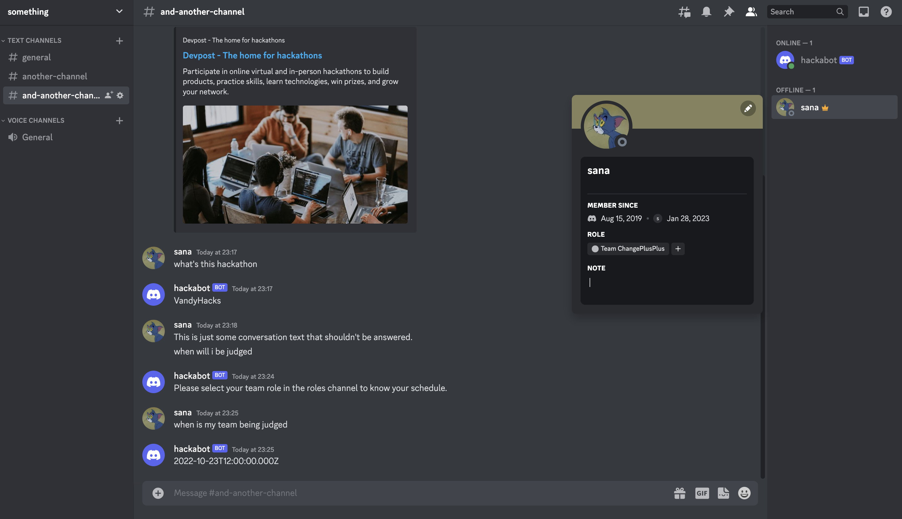

# FAQ-Answering Discord Bot

:link: Bot invite link: https://discord.com/api/oauth2/authorize?client_id=1069033605021569186&permissions=1634235578432&scope=bot

## Problem & Proposed App
The goal is to automate the process of answering hackers question in the VandyHacks Discord chat in order to reduce response times and make things easier for the organizers. So, I have developed a Discord bot that automatically answers the questions it has answers to.  

## Core Features
*   :star: User shouldn't need to use a bot command. The bot should automatically figure out if the question is just an FAQ that's worded differently.
    *   :point_right: Method: A csv file of FAQs with their associated answers must be provided beforehand. I've used `sentence-transformers` for Semantic Textual Similarity which assigns a score on the similarity of a message in the chat and questions in the FAQ list. 
 
 

*   :star: The bot should be able to tell the user the time at which the user's team will be judged.
    *   :point_right: Method: Assuming that the sample JSON text provided in the code challenge for option 1 is similar to how team scheduling is managed in the hackathon, I decided to work around that to know the times for each team. To know which team a user belongs to, they must have selected their team name as a Discord role.
 

 

***Sidenote***: Although I used Python for this project, I am also familiar with Javascript (React). I thought it would be fun to use machine learning sentence similarity on questions asked in the chat, and Python tends to be the better choice while integrating ML. 

#### Future improvements possible:
:green_book: Replacing the FAQ csv to an editable Google Sheets document  
:calendar: Adding a bot command to show users the complete schedule  
:art: Make the datetime answer look nicer  

#### Bot deployment information
(This isn't relevant to bot users, only for the developer end.) 
The following permissions must be enabled in the bot developer settings (https://discord.com/developers/applications).

 
